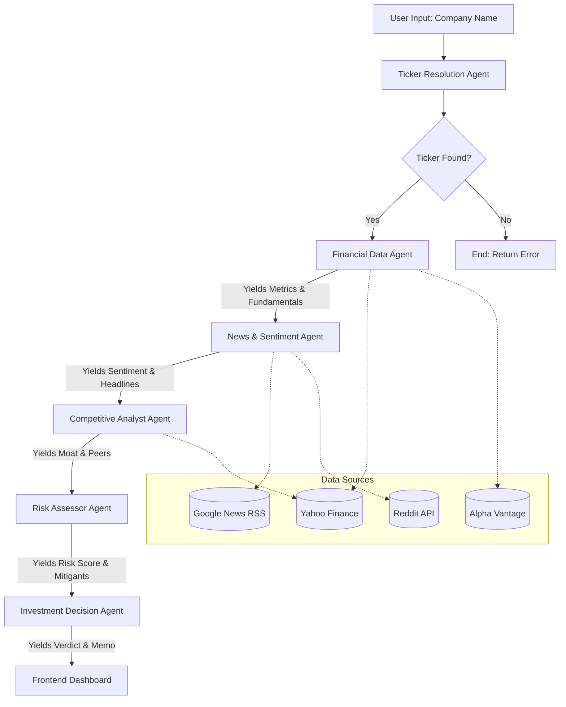

# InvestorIQ — AI Investment Research Agent

> **A multi-agent AI system that researches any company across 5+ data sources and delivers a Wall Street-grade investment verdict with full reasoning.**

Built with **Next.js** · **LangGraph.js** · **Llama 3 / DeepSeek / Mistral** · **Yahoo Finance** · **Alpha Vantage**

---

## Overview

InvestorIQ is an AI-powered investment research agent that takes a company name, conducts comprehensive research across multiple data sources, and produces a structured investment verdict — **Buy, Hold, or Sell** — with a detailed investment memo, confidence score, and risk analysis.

### What it does:
1. **Resolves** the company name to a valid stock ticker using Yahoo Finance + AI
2. **Gathers financial data** from Yahoo Finance (primary) and Alpha Vantage (secondary)
3. **Analyzes news sentiment** from Google News RSS and Reddit
4. **Maps competitive landscape** using peer comparison + AI analysis
5. **Assesses investment risks** by synthesizing financial ratios, news, and market position
6. **Generates an investment verdict** with a confidence score, bull/bear points, target price range, and a full investment memo

---

## How to Run It

### Prerequisites
- **Node.js** 18+ installed
- At least one LLM API key (all have free tiers):
  - **Groq** (recommended) — Free at [https://console.groq.com/](https://console.groq.com/)
  - **DeepSeek** — [https://platform.deepseek.com/](https://platform.deepseek.com/)
  - **OpenRouter** — [https://openrouter.ai/](https://openrouter.ai/)

### Setup

```bash
# 1. Navigate to the project
cd investoriq

# 2. Install dependencies
npm install

# 3. Set up environment variables
cp .env.example .env.local
# Edit .env.local and add your API keys

# 4. Run the development server
npm run dev
```

### Environment Variables

| Variable | Required | Description |
|----------|----------|-------------|
| `GROQ_API_KEY` | At least one | Primary LLM — Llama 3 (70B) via Groq |
| `DEEPSEEK_API_KEY` | At least one | Secondary LLM — DeepSeek V3 |
| `OPENROUTER_API_KEY` | At least one | Tertiary LLM — Aggregator fallback |
| `ALPHA_VANTAGE_API_KEY` | No | Enables additional financial data |

> **Note:** You need at least one LLM key configured. The system automatically falls back through the provider chain if one is rate-limited or unavailable.

Open [http://localhost:3000](http://localhost:3000) in your browser.

---

## How It Works — Architecture

### Tech Stack
| Layer | Technology |
|-------|-----------|
| Frontend | Next.js (App Router), React, CSS Modules |
| Backend | Next.js API Routes (Serverless on Vercel) |
| AI Framework | LangGraph.js (stateful multi-agent graph) |
| LLM Providers | Groq (Llama 3), DeepSeek, OpenRouter — via `@langchain/openai` |
| Financial Data | `yahoo-finance2` + Alpha Vantage REST API |
| News | Google News RSS + Reddit JSON API |
| Styling | Custom CSS with glassmorphic dark theme |

### Multi-Agent Pipeline (LangGraph)

The core of InvestorIQ is a **6-node LangGraph state graph**. Each node is a specialized AI agent:

### Dataflow Diagram



| Agent | Purpose | Data Sources |
|-------|---------|-------------|
| **Ticker Resolution** | Convert company name → valid ticker | Yahoo Finance Search + LLM |
| **Financial Data Collector** | Pull quantitative metrics | Yahoo Finance + Alpha Vantage |
| **News & Sentiment Analyst** | Gather and score news | Google News RSS + Reddit |
| **Competitive Analyst** | Map industry position | Yahoo Finance Peers + LLM |
| **Risk Assessor** | Identify and score risks | Synthesis of all prior data + LLM |
| **Investment Decision** | Final verdict + memo | All data → LLM structured output |

---

## Working (User Journey)

1. **Search**: The user enters a company name (e.g., "Apple" or "Infosys") into the glowing search bar on the landing page.
2. **Analysis Pipeline**: The user is redirected to a loading screen. Here, they see a real-time, step-by-step pipeline visualization as the 6 LangGraph agents sequentially trigger, fetch data, and process insights.
3. **Verdict**: Once the AI completes its reasoning (typically 7-12 seconds), the user is presented with the final results dashboard.
4. **Dashboard Exploration**:
   - The user immediately sees the **Target Verdict** (Buy/Hold/Sell) and a **Confidence Score** out of 100.
   - The user can click through the 5 tabs to deeply explore the LLM's reasoning: analyzing financial tables, reading sentiment-scored news articles, viewing the competitive moat rating, and reading the detailed Bull/Bear investment memo.
5. **Agent Activity**: An animated sidebar shows the exact timestamps and decisions made by the LLM during the pipeline execution.

---

## Folder Structure

```
investoriq/
├── src/
│   ├── app/
│   │   ├── layout.tsx              # Root layout (fonts, metadata)
│   │   ├── page.tsx                # Landing/search page
│   │   ├── page.module.css         # Landing page styles
│   │   ├── globals.css             # Design system tokens
│   │   ├── api/research/route.ts   # POST endpoint → LangGraph agent
│   │   └── research/
│   │       ├── page.tsx            # Results dashboard
│   │       └── page.module.css     # Dashboard styles
│   └── lib/
│       ├── agent/
│       │   ├── state.ts            # LangGraph state schema
│       │   ├── graph.ts            # Graph compilation
│       │   ├── prompts.ts          # Centralized LLM prompts
│       │   └── nodes/
│       │       ├── resolveTicker.ts
│       │       ├── gatherFinancials.ts
│       │       ├── analyzeNews.ts
│       │       ├── analyzeCompetition.ts
│       │       ├── assessRisk.ts
│       │       └── generateVerdict.ts
│       ├── datasources/
│       │   ├── yahooFinance.ts     # Yahoo Finance wrapper
│       │   ├── alphaVantage.ts     # Alpha Vantage wrapper
│       │   ├── googleNews.ts       # Google News RSS parser
│       │   ├── redditSearch.ts     # Reddit search
│       │   └── webScraper.ts       # Generic web scraper
│       └── utils/
│           ├── llm.ts              # Multi-provider LLM with fallback
│           └── formatters.ts       # Number/currency formatters
├── .env.example
├── next.config.ts
├── package.json
└── README.md
```

---

## Example Runs

### Example 1: NVIDIA (Strong Growth Tech)
- **Ticker Resolved**: NVDA (NASDAQ)
- **Key Metrics**: Market Cap ~$3.3T, Revenue Growth +122%, P/E ~58x
- **Sentiment**: Very Bullish (0.78) — AI infrastructure demand, strong earnings
- **Moat**: Wide — CUDA ecosystem lock-in, 80%+ data center GPU share
- **Risk Score**: 3.5/10 (Low) — Valuation risk, customer concentration
- **Verdict**: **Strong Buy** (Confidence: 89/100)

### Example 2: Infosys (Indian IT Services)
- **Ticker Resolved**: INFY (NSE)
- **Key Metrics**: Revenue Growth ~5-7%, Profit Margin ~21%, P/E ~27x
- **Sentiment**: Neutral (0.12) — Steady growth, no major catalysts
- **Moat**: Narrow — Scale and client relationships
- **Risk Score**: 4.2/10 (Medium) — IT spending cycles, currency risk
- **Verdict**: **Hold** (Confidence: 72/100)

### Example 3: A Struggling Company
- **Verdict**: Typically **Sell** or **Strong Sell** based on:
  - Declining revenue and margins
  - Negative news sentiment
  - High risk scores
  - Narrow or no competitive moat

---

## What I Would Improve With More Time

1. **Real-time streaming** — Use Server-Sent Events to stream agent progress to the frontend as each node completes
2. **SEC EDGAR integration** — Parse 10-K/10-Q filings for deeper fundamental analysis
3. **Earnings call transcripts** — NLP analysis of management commentary
4. **Historical research comparison** — Compare today's verdict to last month's
5. **Portfolio mode** — Research multiple companies and compare side-by-side
6. **Charts & visualizations** — Interactive stock price charts, revenue trend charts using Recharts
7. **Caching layer** — Neon PostgreSQL to cache research results and avoid redundant API calls
8. **PDF/Report export** — Generate downloadable investment memo PDFs

---

## Built By & AI Bonus

**Anurag** — Built using AI as mandated. 

**Bonus Points:** All LLM chat session logs and transcripts have been included in the `llm_chat_logs/` directory in the root of the repository. This provides full insight into the thought process, architectural pivots, and approach used during the build.

---

*InvestorIQ © 2026 — Built with Next.js, LangGraph.js & Llama 3*
