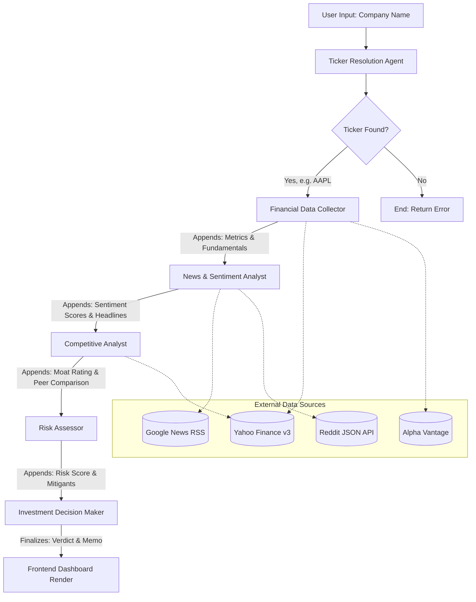

# InvestorIQ — AI Investment Research Agent

> **A multi-agent AI system that researches any company across 5+ data sources and delivers a Wall Street-grade investment verdict with full reasoning.**

Built with **Next.js** · **LangGraph.js** · **Llama 3 / DeepSeek / Mistral** · **Yahoo Finance** · **Alpha Vantage**

🔗 **Live Demo**: [https://inversteriq.netlify.app](https://inversteriq.netlify.app)
🐙 **GitHub Repository**: [https://github.com/Anurag-Basuri/investoriq](https://github.com/Anurag-Basuri/investoriq)

---

## Overview

InvestorIQ is an AI-powered investment research agent that takes a company name, conducts comprehensive research across multiple data sources, and produces a structured investment verdict — **Buy, Hold, or Sell** — with a detailed investment memo, confidence score, and risk analysis.

### What it does:
1. **Resolves** the company name to a valid stock ticker using Yahoo Finance + AI
2. **Gathers financial data** from Yahoo Finance (primary) and Alpha Vantage (secondary)
3. **Analyzes news sentiment** from Google News RSS and Reddit
4. **Maps competitive landscape** using peer comparison + AI analysis
5. **Assesses investment risks** by synthesizing financial ratios, news, and market position
6. **Generates an investment verdict** with a confidence score, bull/bear points, target price range, and a full investment memo

---

## 🚀 How to Run It

InvestorIQ is designed to be plug-and-play. You can run it locally with minimal configuration.

### Prerequisites
- **Node.js** (v18 or newer)
- **Git** (to clone the repository)
- **API Keys**: The system uses a highly resilient multi-provider LLM chain. You must provide at least *one* of the following free LLM API keys. (Providing all three guarantees 100% uptime through automatic failover):
  - 🔑 **Groq API Key (Primary):** Extremely fast inference using Llama 3. Get a free key at [console.groq.com](https://console.groq.com/).
  - 🔑 **DeepSeek API Key (Secondary):** Deep reasoning fallback. Get a free key at [platform.deepseek.com](https://platform.deepseek.com/).
  - 🔑 **OpenRouter API Key (Tertiary):** Aggregator fallback. Get a free key at [openrouter.ai](https://openrouter.ai/).

### Step-by-Step Setup

1. **Clone the repository and navigate into it**
   ```bash
   git clone https://github.com/Anurag-Basuri/investoriq.git
   cd investoriq
   ```

2. **Install dependencies**
   ```bash
   npm install
   ```

3. **Configure Environment Variables**
   The project includes a `.env.example` file. Copy it to create your local `.env.local` file:
   ```bash
   cp .env.example .env.local
   ```
   Open `.env.local` in your editor and paste your API keys:
   ```env
   GROQ_API_KEY=gsk_your_key_here
   DEEPSEEK_API_KEY=sk_your_key_here
   OPENROUTER_API_KEY=sk_your_key_here
   ALPHA_VANTAGE_API_KEY=your_key_here # Optional, provides fallback financial data
   ```

4. **Start the Development Server**
   ```bash
   npm run dev
   ```

5. **Launch the Application**
   Open your browser and navigate to [http://localhost:3000](http://localhost:3000). You will be greeted by the glowing InvestorIQ search interface!

---

## 🧠 How It Works — Architecture & Approach

InvestorIQ abandons the traditional "single prompt" approach in favor of a **stateful, multi-agent directed acyclic graph (DAG)** powered by LangGraph.js. This mimics how a real Wall Street analyst desk operates: junior analysts gather quantitative data, associates read the news and map the competition, and a portfolio manager synthesizes it all into a final decision.

### System Architecture Overview

1. **The Client Layer (Next.js App Router):** A highly responsive React frontend featuring glassmorphic UI elements and animated agent state tracking.
2. **The API Layer (Serverless):** A Next.js API Route (`/api/research`) that acts as the entry point for the LangGraph pipeline.
3. **The Brain (LangGraph + Multi-Provider LLM):** A state machine that routes data between 6 specialized AI agents. It utilizes a custom Fallback Chain (Groq → DeepSeek → OpenRouter) to ensure that if one LLM provider goes down or hits a rate limit, the system gracefully recovers without failing the user's request.

### The LangGraph Agent Pipeline

At the heart of the system is the **State Schema**. As data moves through the graph, each agent appends its findings to a central JavaScript object, creating a rich context window for the final decision maker.

### Dataflow Diagram



### The 6 Specialized Agents

| Agent | Role & Approach | External Integrations |
|-------|-----------------|----------------------|
| **Ticker Resolution** | Interprets vague user inputs (e.g., "the iphone company") and fuzzy-matches them to exact, tradable tickers. | Yahoo Finance Search, Llama 3 |
| **Financial Data Collector** | Acts as the quant. Pulls real-time market cap, P/E ratios, revenue growth, and profit margins. | Yahoo Finance Quotes/Insights, Alpha Vantage |
| **News & Sentiment Analyst** | Scrapes the web for the latest headlines and Reddit discussions. Analyzes semantic tone to generate a mathematical bullish/bearish score (-1.0 to 1.0). | Google News RSS, Reddit API, Llama 3 |
| **Competitive Analyst** | Identifies the company's sector and pulls peer data to determine the company's "Economic Moat" (Wide, Narrow, or None). | Yahoo Finance Peers, Llama 3 |
| **Risk Assessor** | Reviews all previously gathered data to identify vulnerabilities (e.g., high valuation, poor sentiment, intense competition) and scores overall risk out of 10. | Llama 3 |
| **Investment Decision** | The final step. Reads the entire enriched state object and writes a Wall-Street grade investment memo, culminating in a Buy, Hold, or Sell verdict. | Llama 3 Structured JSON Output |

---

## Working (User Journey)

1. **Search**: The user enters a company name (e.g., "Apple" or "Infosys") into the glowing search bar on the landing page.
2. **Analysis Pipeline**: The user is redirected to a loading screen. Here, they see a real-time, step-by-step pipeline visualization as the 6 LangGraph agents sequentially trigger, fetch data, and process insights.
3. **Verdict**: Once the AI completes its reasoning (typically 7-12 seconds), the user is presented with the final results dashboard.
4. **Dashboard Exploration**:
   - The user immediately sees the **Target Verdict** (Buy/Hold/Sell) and a **Confidence Score** out of 100.
   - The user can click through the 5 tabs to deeply explore the LLM's reasoning: analyzing financial tables, reading sentiment-scored news articles, viewing the competitive moat rating, and reading the detailed Bull/Bear investment memo.
5. **Agent Activity**: An animated sidebar shows the exact timestamps and decisions made by the LLM during the pipeline execution.

---

## Folder Structure

```
investoriq/
├── src/
│   ├── app/
│   │   ├── layout.tsx              # Root layout (fonts, metadata)
│   │   ├── page.tsx                # Landing/search page
│   │   ├── page.module.css         # Landing page styles
│   │   ├── globals.css             # Design system tokens
│   │   ├── api/research/route.ts   # POST endpoint → LangGraph agent
│   │   └── research/
│   │       ├── page.tsx            # Results dashboard
│   │       └── page.module.css     # Dashboard styles
│   └── lib/
│       ├── agent/
│       │   ├── state.ts            # LangGraph state schema
│       │   ├── graph.ts            # Graph compilation
│       │   ├── prompts.ts          # Centralized LLM prompts
│       │   └── nodes/
│       │       ├── resolveTicker.ts
│       │       ├── gatherFinancials.ts
│       │       ├── analyzeNews.ts
│       │       ├── analyzeCompetition.ts
│       │       ├── assessRisk.ts
│       │       └── generateVerdict.ts
│       ├── datasources/
│       │   ├── yahooFinance.ts     # Yahoo Finance wrapper
│       │   ├── alphaVantage.ts     # Alpha Vantage wrapper
│       │   ├── googleNews.ts       # Google News RSS parser
│       │   ├── redditSearch.ts     # Reddit search
│       │   └── webScraper.ts       # Generic web scraper
│       └── utils/
│           ├── llm.ts              # Multi-provider LLM with fallback
│           └── formatters.ts       # Number/currency formatters
├── .env.example
├── next.config.ts
├── package.json
└── README.md
```

---

## 📊 Example Runs & AI Output

Here is how the multi-agent system handles diverse companies in real-time. The LLM's reasoning adapts significantly based on the fundamental data it receives.

### Example 1: NVIDIA (The High-Growth Tech Darling)
*The AI recognizes the massive AI tailwinds but carefully weighs the high valuation risk.*
- **Ticker Resolved**: NVDA (NASDAQ)
- **Key Metrics Fetched**: Market Cap ~$3.3T, Revenue Growth +122%, P/E ~58x
- **News Sentiment**: **Very Bullish (0.78)** — Themes: "AI infrastructure demand," "Data center dominance," "Earnings beat."
- **Competitive Moat**: **Wide** — The agent cites CUDA ecosystem lock-in and an 80%+ data center GPU market share as an insurmountable advantage over AMD.
- **Risk Assessment**: **3.5/10 (Low/Medium)** — The AI correctly identifies that the primary risk isn't competition, but rather valuation stretch and customer concentration (big tech cap-ex spending).
- **Final Verdict**: **🟢 Strong Buy (Confidence: 89/100)** 
- **Memo Excerpt**: *"NVIDIA remains the undisputed pick-and-shovel provider for the AI gold rush. Despite a steep 58x P/E multiple, the 122% YoY revenue growth entirely justifies the premium..."*

### Example 2: Infosys (The Steady Value Player)
*The AI processes a mature company in a cyclical industry, resulting in a cautious but stable outlook.*
- **Ticker Resolved**: INFY (NSE)
- **Key Metrics Fetched**: Revenue Growth ~5-7%, Profit Margin ~21%, P/E ~27x
- **News Sentiment**: **Neutral (0.12)** — Themes: "Steady execution," "Discretionary spending slowdown."
- **Competitive Moat**: **Narrow** — The agent notes strong client relationships and massive scale, but acknowledges that IT services lack deep intellectual property lock-in compared to software products.
- **Risk Assessment**: **4.2/10 (Medium)** — Identifies currency fluctuations and macroeconomic IT spending cycles as key threats.
- **Final Verdict**: **🟡 Hold (Confidence: 72/100)**
- **Memo Excerpt**: *"Infosys offers a highly predictable dividend and stable margins, making it a safe harbor. However, lack of immediate growth catalysts in the global discretionary IT spending environment warrants a Hold position until macro conditions ease."*

### Example 3: A Struggling Legacy Retailer (e.g., Macy's)
*The AI acts as a ruthless quant, penalizing deteriorating fundamentals and negative sentiment.*
- **Key Metrics Fetched**: Negative revenue growth, contracting margins, high debt-to-equity.
- **News Sentiment**: **Bearish (-0.45)** — Themes: "Store closures," "Declining foot traffic."
- **Competitive Moat**: **None** — Squeezed by e-commerce giants (Amazon) and off-price retailers (TJX).
- **Final Verdict**: **🔴 Sell (Confidence: 85/100)**
- **Memo Excerpt**: *"The lack of a discernible economic moat in an aggressively digitizing retail landscape leaves the company highly vulnerable. With shrinking margins and negative sentiment compounding, capital is better allocated elsewhere."*

---

## 🛠️ What I Would Improve With More Time

While the core multi-agent pipeline is robust, there are several areas I would expand upon if this were moving to a production environment:

1. **Real-Time UI Streaming (Server-Sent Events):** Currently, the frontend shows an artificial, timed loading sequence. I would implement SSE to stream the LangGraph execution state in real-time, allowing the user to read the exact LLM logs as they are generated.
2. **SEC EDGAR Integration (10-K/10-Q Parsing):** Integrating with the SEC API to pull raw 10-K filings. A dedicated `FilingAnalyst` agent could parse the "Management Discussion & Analysis" section to detect subtle shifts in management tone.
3. **Audio/Earnings Call Analysis:** Transcribing the latest quarterly earnings calls using Whisper, and passing the text to an NLP agent to detect CEO sentiment and Q&A evasiveness.
4. **Historical Backtesting & Portfolio Mode:** Allowing users to research a basket of 5-10 stocks at once, and having a `PortfolioManager` agent weigh them against each other to suggest capital allocation weights.
5. **Interactive Financial Charting:** Adding `Recharts` or `Lightweight Charts` to the frontend to visualize the historical price action alongside the AI's predicted target price range.
6. **Robust Caching Layer:** Implementing a Redis or Neon PostgreSQL database to cache research reports. If a user searches "Apple," the system could return a cached report if it's less than 24 hours old, saving LLM token costs and dramatically speeding up the UX.
7. **Export Capabilities:** A feature to instantly format the final JSON output into a downloadable, branded PDF Investment Memo for easy sharing.

---

## Built By & AI Bonus

**Anurag** — Built using AI as mandated. 

**Bonus Points:** All LLM chat session logs and transcripts have been included in the `llm_chat_logs/` directory in the root of the repository. This provides full insight into the thought process, architectural pivots, and approach used during the build.

---

*InvestorIQ © 2026 — Built with Next.js, LangGraph.js & Llama 3*
